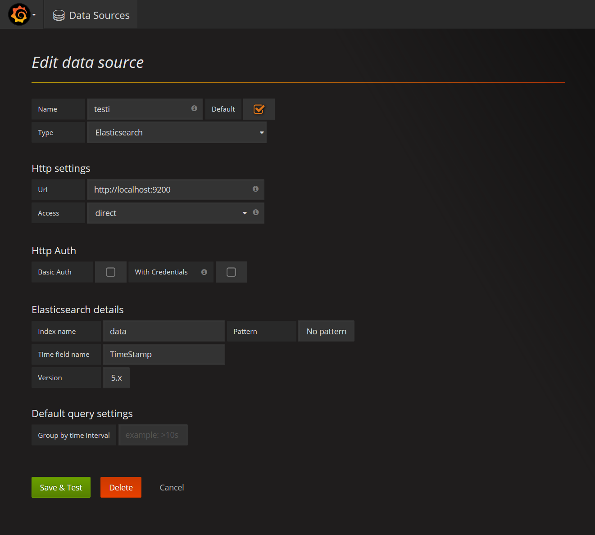

# Setup

```
docker-compose up
```

Now elastic runs on `http://localhost:9200` and grafana on `http://localhost:3000`. 

# Configuration 
## Login
Default grafana login is `admin/admin`

## Datasource
Configure grafana with following: 



# Contributing & issues & questions
Please see the [CONTRIBUTING.md](.github/CONTRIBUTING.md) file for guidelines.

# LICENSE
[The MIT License (MIT)](LICENSE)

Copyright (c) 2017 Protacon Solutions